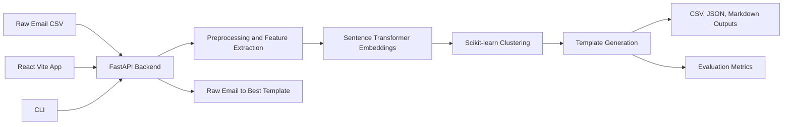

# Email Template Generation

[](https://www.python.org/)
[](https://fastapi.tiangolo.com/)
[](https://vite.dev/)
[](https://docs.pytest.org/)

NLP-powered email standardization and template generation system built with Python, Hugging Face Sentence Transformers, Scikit-learn, Pandas, FastAPI, React, Vite, TypeScript, Tailwind CSS, Motion for React, and a small command-line interface.

## Overview

This project analyzes raw business email datasets, groups semantically similar messages, and generates reusable professional templates with placeholders such as `{recipient_name}`, `{deadline}`, `{invoice_no}`, and `{sender_name}`. Claude Code built the FastAPI backend and ML pipeline; Codex adds the premium React frontend, CLI, integration polish, tests, documentation, and project packaging around that backend contract.

The bundled sample dataset contains 1,100 generated email examples across common communication patterns such as follow-ups, requests, complaints, confirmations, apologies, invoices, introductions, announcements, and thank-you notes.

## Problem Statement

Teams often send many variations of the same operational email: follow-ups, invoice reminders, support apologies, confirmations, urgent requests, and customer complaints. Without standardization, tone and structure drift across senders. This project demonstrates how sentence embeddings, clustering, and template extraction can turn raw historical messages into consistent reusable communication templates.

## Tech Stack

- Python 3.10+
- FastAPI and Uvicorn for the backend API
- Hugging Face Sentence Transformers for semantic embeddings
- Scikit-learn for clustering and evaluation metrics
- Pandas and NumPy for data processing
- React, Vite, TypeScript, Tailwind CSS, Motion for React, and Lucide React for the user interface
- HTTPX for frontend and CLI API calls
- Pytest for unit and integration tests

## Architecture



## Project Structure

```text
email-template-generation/
├── backend/
│   ├── main.py
│   ├── api/
│   ├── core/
│   └── utils/
├── frontend/
│   ├── index.html
│   ├── package.json
│   ├── vite.config.ts
│   ├── tailwind.config.js
│   └── src/
│       ├── api/
│       ├── components/
│       ├── types/
│       └── utils/
├── data/
│   ├── raw/
│   ├── processed/
│   └── sample_emails.csv
├── models/
│   └── fine_tuned_sentence_transformer/
├── outputs/
│   ├── templates.csv
│   ├── templates.json
│   └── templates.md
├── tests/
├── app.py
├── cli.py
├── README.md
├── requirements.txt
├── pyproject.toml
├── .env.example
├── .gitignore
├── Makefile
└── resume_summary.md
```

## Dataset Format

Required CSV columns:

```csv
email_id,subject,body
E0001,Following up on invoice,"Hi Alex, just checking whether invoice INV-123 has been processed."
```

Optional columns improve clustering labels and template metadata:

```csv
category,tone,sentiment,sender,recipient,created_at
follow_up,neutral,neutral,Taylor,Alex,2026-04-28
```

Extra columns are accepted by the loader, but the backend requires at least `email_id`, `subject`, and `body`.

## Installation

```bash
python -m venv .venv
source .venv/bin/activate
pip install -r requirements.txt
cp .env.example .env
cd frontend && npm install
```

On systems where `python` points to Python 2 or is unavailable, use `python3` for the same commands.

## Run The Backend

```bash
uvicorn backend.main:app --reload
```

The backend will be available at `http://127.0.0.1:8000`. The first full pipeline run may download the configured Sentence Transformer model.

## Run The React Frontend

In a second terminal:

```bash
cd frontend
npm run dev
```

The React app reads `VITE_API_BASE_URL` and falls back to `http://localhost:8000`. Copy `frontend/.env.example` to `frontend/.env` if you want to customize the backend URL.

The old Streamlit entrypoint is kept only as a legacy fallback:

```bash
streamlit run app.py
```

## CLI Usage

The CLI can use a running backend with `--backend-url`, or run the FastAPI app in-process when no backend URL is provided.

```bash
python cli.py load-sample
python cli.py run --input data/sample_emails.csv
python cli.py fine-tune --input data/sample_emails.csv
python cli.py templates --format markdown
python cli.py templates --format json --output outputs/templates_export.json
python cli.py metrics
```

Equivalent Makefile shortcuts:

```bash
make backend
make frontend
make frontend-build
make cli-run
make test
```

## Fine-Tuning Workflow

1. Upload or provide a CSV with required email columns.
2. Run baseline pipeline to generate clusters and metrics.
3. Fine-tune the Sentence Transformer using labeled categories or weak pseudo-labels.
4. Re-run the pipeline with `use_fine_tuned=true` or `--use-fine-tuned`.
5. Compare silhouette score and cluster quality before and after fine-tuning.

Example:

```bash
python cli.py fine-tune --input data/sample_emails.csv --epochs 1 --batch-size 16
python cli.py run --input data/sample_emails.csv --use-fine-tuned
```

## API Endpoints

| Method | Endpoint | Purpose |
| --- | --- | --- |
| `GET` | `/health` | Check backend status and loaded artifact counts |
| `POST` | `/api/upload` | Upload and validate a CSV file |
| `POST` | `/api/run-pipeline` | Run preprocessing, embeddings, clustering, templates, and metrics |
| `POST` | `/api/fine-tune` | Fine-tune Sentence Transformer embeddings |
| `GET` | `/api/templates` | List generated templates |
| `GET` | `/api/templates/{template_id}` | Fetch a single template |
| `GET` | `/api/evaluation` | Return latest evaluation metrics |
| `GET` | `/api/outputs/{csv,json,markdown}` | Download generated templates |
| `POST` | `/api/generate-template` | Match a raw email to the closest generated template |

## Example Raw Email Match

Request:

```json
{
  "subject": "Checking in on the migration project",
  "body": "Hi Jordan,\n\nJust circling back on the migration project. Did you get a chance to review the notes I sent over?\n\nThanks,\nTaylor",
  "top_k": 1
}
```

Example template:

```markdown
Subject: Checking in on the migration project

Hi {recipient_name},

Just circling back on the migration project. Did you get a chance to review the materials I sent over? Happy to jump on a call if it's easier.

Thanks,
{sender_name}
```

## Evaluation Metrics

- `silhouette_score`: How well-separated the generated clusters are. Higher is generally better.
- `davies_bouldin_score`: Cluster compactness/separation measure. Lower is generally better.
- `average_intra_cluster_similarity`: Average semantic similarity among emails in the same cluster.
- `template_coverage`: Share of emails represented by generated templates.
- `duplicate_template_percentage`: Percentage of generated templates that appear redundant.
- `average_template_length`: Mean generated template body length.
- `average_readability`: Optional readability score when available.
- `fine_tuning_improvement`: Difference between fine-tuned and baseline silhouette scores when both are available.

## Testing

```bash
pytest
pytest -k api
pytest -k cli
```

The test suite mocks heavyweight embedding calls where appropriate, so it does not need to download Sentence Transformer weights during unit and integration tests.

## Future Improvements

- Add async background jobs for long-running fine-tuning runs.
- Add authenticated multi-user project storage instead of in-memory pipeline state.
- Persist evaluation history across runs for model comparison.
- Add human-in-the-loop editing and approval for generated templates.
- Add a lightweight email intent classifier on top of the clustered templates.
- Package a production Docker Compose setup for separate API and UI services.

## Resume Bullets

- Built an NLP-powered email standardization and template generation system that analyzed 1,000+ raw email samples and generated reusable professional templates.
- Fine-tuned Sentence Transformer embeddings using labeled and weakly supervised email pairs to improve semantic clustering quality.
- Applied text preprocessing, sentiment and tone detection, feature extraction, and Scikit-learn clustering to identify repeated communication patterns.
- Developed a FastAPI backend with endpoints for CSV upload, pipeline execution, fine-tuning, template retrieval, and evaluation metrics.
- Created an interactive React, TypeScript, and Tailwind CSS interface plus CLI for uploading datasets, running the ML pipeline, browsing templates, and exporting results.
- Improved communication consistency by standardizing common email intents such as follow-ups, requests, complaints, confirmations, and apologies.
